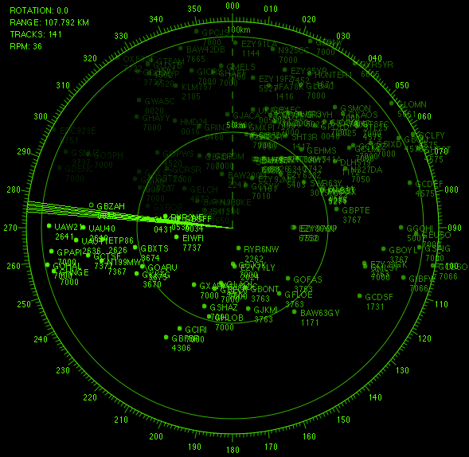

## Scope1090



scope1090 was prototyped in Autumn 2019 as a traditional radar scope representation. It has since been re-written in an effort for me to learn Kotlin. Being written in a JVM compatible language allows for high portability between multiple operating systems and does not require any source code compilation by end-users.

### Features
- Fading effect on tracks as the sweep interrogator rotates
- Set the number of rotations per minute for the sweep
- Scale the viewport of the scope
- Rotate and align the scope

### Installation
**Windows Installation**
1. Download Java 8 or newer from https://www.java.com/en/download/
2. Download the latest scope1090 jar archive from the Releases tab
3. Open a command prompt in the same location you downloaded scope1090
4. Run `java -jar scope1090-1.0-SNAPSHOT-shaded.jar --lat=(your latitude) --lon=(your longitude)` to start scope1090

**Linux, Raspberry Pi**
1. Download Java 8 or newer by running `apt-get install default-jre`
2. Download the latest scope1090 jar archive from the Releases tab
3. Open a terminal window and navigate to where scope1090 is located
4. Run `java -jar scope1090-1.0-SNAPSHOT-shaded.jar --lat=(your latitude) --lon=(your longitude)` to start scope1090

**MacOS / OSX**
1. Download Java 8 or newer from https://www.java.com/en/download/
2. Download the latest scope1090 jar archive from the Releases tab
3. Open a terminal window and navigate to where scope1090 is located
4. Run `java -jar scope1090-1.0-SNAPSHOT-shaded.jar --lat=(your latitude) --lon=(your longitude)` to start scope1090

Remember to check the version you have downloaded, you will need to adjust the command for this. These examples use `1.0-SNAPSHOT`.

scope1090 is not fully tested on a retina display and may cause issues with rendering

### Performance
Scope1090 will work well on any modern computer. Where applicable, Improvements have been put in place to increase performance on low-end devices such as a raspberry pi, for example, track callouts, range markers, and the scope gauge, are all cached between repaints.

### Options
Since 1.1, you may customise the scope using the following command line arguments, an example:
```
java -jar scope1090-1.1-SNAPSHOT-shaded.jar --lat=0.0 --lon=-0.0 --sbs=127.0.0.1:30003 --rpm=30
```

| Option  | Description                                                                       |
|---------|-----------------------------------------------------------------------------------|
| --lat   | Latitude of center of scope (required)                                            |
| --lon   | Longitude of center of scope (required)                                           |
| --sbs   | Define a BaseStation data source connection in the format `--sbs=127.0.0.1:30003` |
| --adsbx | Connect to ADS-B Exchange using an API key `--adsbx=(your api key)`               |
| --hd    | Enable high quality rendering hints
| --rpm   | Revolutions per minute of the radar sweep. Default: 36. Set to 0 to disable sweep |
| --fade  | Set the amount of seconds for a track to disappear after being interrogated |                  
| --color | The colour (expressed as a hexadecimal, #00FF00) to use for the display |
| --markers | Distance (in kilometres) of the range markers. Default: 50. Set to 0 to disable |
| --nocursor | Remove the north-facing dashed cursor |
| --nobuttons | Disable the left and right MFD-like buttons |
| --fullscreen | Open's the window in fullscreen |

**Example**
```
java -jar scope1090-1.1-SNAPSHOT-shaded.jar --lat=0.0 --lon=-0.0 --sbs=127.0.0.1:30003 --hd --fade=2 --markers=10 --fullscreen --nocursor --nobuttons
```

scope1090 enforces a maximum range of 250 nautical miles, with a refresh rate of 7 seconds for all ADS-B Exchange connections. Attempting to increase the refresh rate may put additional load on the servers and lead to your API key being revoked.

### Operating in no-sweep mode
You may disable the sweep line by setting `--rpm=0` as a command line argument. Track alpha will be set on the time elapsed since a position was last received. Disable track alpha altogether using: `--fade=0`

### Supported data sources
To populate the screen with tracks you will need to connect to a supported data source. scope1090 currently supports the following data sources
- Using a local or remote receiver (BaseStation TCP server)
- Using your ADS-B Exchange API key

### Scope Controls
| Action             | Description                                               |
|--------------------|-----------------------------------------------------------|
| Mouse Wheel        | Increase or decrease the range of the viewport            |
| Mouse Wheel + CTRL | Rotate the offset of the scope clockwise/anti-clockwise   |

### Operational Warning
By using this software you agree that the contributors and developers of scope1090 cannot be held responsible or liable for any damages. The use of scope1090 is intended purely for entertainment purposes. scope1090 is not intended to be used in an operational setting.

### Contributors
Thanks to supporters in the ADS-B and aviation communities for assisting with design and behavioural aspects of scope1090